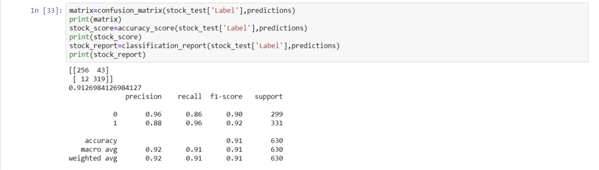

# Stock-Sentiment-Analysis

# Relation of Stock sentiment with news headlines.
The top MNC's like Google, Tesla, Apple are always in the hunt for increasing their stock values and what more could be a better way to directly relate these stocks other than news headlines. These headlines are always read and advertised which by a plethora of companies and would definitely be a helpful source to predict the stock's sentiment i.e. the positive or the negative impact on the stocks of these companies based on the headlines.Aim of this project is to create model/models which would provide the best means to predict if the value of a stock would increase or decrease on the basis of top 25 news headlines.

# Description:
Aim of this project is to create model/models which would provide the best means to predict if the value of a stock would increase or decrease on the basis of top 25 news headlines. You could run the whole code mentioned in the jupyter notebook in an ipynb format.

# Data

The data mainly includes 4101 tuples and 27 attributes out of which 25 are the "Top 25" headlines and "label" is distributed along the dataframe in a binary format where, 0 indicates a negative impact and 1 indicates a positive response on the stock.

The data source for this project is: https://www.kaggle.com/aaron7sun/stocknews

# Models

1) Feature Extraction - Countvectorizer() and TfidfVectorizer() from scikit learn library used for text classification and converting the headlines to vectors.
2) Support Vector Machine, Random Forest Classifier, Naive Bayes (Bernoulli).

# Results
Following the feature extraction, for all the models trained and tested, Support Vector Machine was the most successful algorithm with the accuracy of 91.2 %

